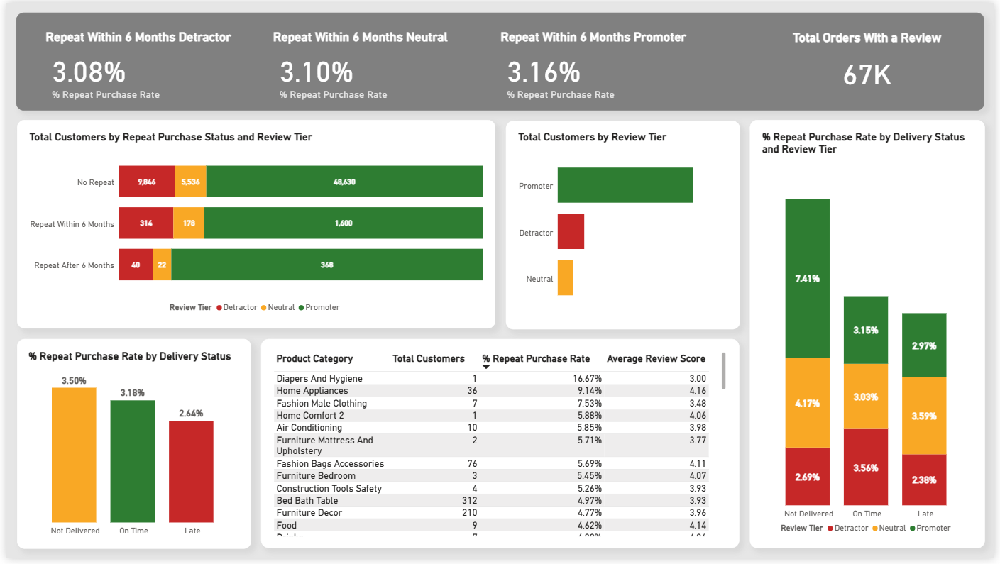

# Olist E-Commerce: Review Scores & Repeat Purchase Behavior

Analyzing the repeat purchase behavior on Olist and whether customer reviews affect that behavior.



[](https://app.powerbi.com/links/n1KF1reg1w?ctid=a6c348d1-c407-43cb-b532-13fe5b3b952d&pbi_source=linkShare)

## Overview

### What is Olist
Olist is a Brazilian e-commerce platform that helps small and medium-sized businesses sell their products online on major marketplaces. This project covers roughly 100,000 orders from 2016 to 2018 across Brazil.

### Central Question
By analyzing this dataset, this project explores whether the review scores affect the customer's repeat purchase behavior.

### Why?
This is important for Olist because they can use this information to help the businesses encourage customers to return. The businesses then can focus on maximizing the retention rate.

## Dataset

### Source
I used the Brazilian E-Commerce Public Dataset by Olist on Kaggle: [Brazilian E-Commerce Public Dataset](https://www.kaggle.com/datasets/olistbr/brazilianecommerce/data?select=olist_orders_dataset.csv)

### Tables
- **customers** – Has information about the customer and its location.
- **geolocation** – Contains Brazilian zip codes and its lat/lng coordinates.
- **order_items** – Includes the items purchased within each order.
- **order_reviews** – Stores the reviews made by the customers.
- **orders** – Has information about the orders and their status.
- **product_category_name_translation** – Contains the translation of the product_category_name column to English.
- **products** – Includes the products sold by Olist.
- **sellers** – Stores the sellers that have completed orders at Olist.

### Volume
This dataset has:
- 96,096 unique customers
- 98,666 unique orders
- 98,410 unique reviews
- 32,951 unique products
- 3,096 unique sellers

The dataset contains information from 2016 to 2018.

## Project Pipeline

### Diagram
Raw Data (CSV files) → PostgreSQL → Power BI

### Explanation
There were two tools used for this project: PostgreSQL and Power BI. PostgreSQL was used to create tables using the data from the CSV files available on the Brazilian E-Commerce Public Dataset by Olist on Kaggle and handle all data cleaning and transformation. Once the data was cleaned new CSV files were created with the clean version of each table and transferred to Power BI. Power BI was then used to create new measures and build a dashboard to showcase the results of this project.

## Data Cleaning & Transformation (SQL)

### Key Decisions
To begin with, I created the tables on PostgreSQL to transfer the data from the CSV files.

Then, I checked if there were any NULL or duplicate values:
- The only table with duplicates was geolocation.
- The tables with NULL values were order_reviews, orders and products.

After I verified these values, I cleaned each table:

**customers:** I started with the table customers where the only column that required cleaning was customer_city. I performed text standardization, title casing city names and removing accents since there were cities written in different ways.

**geolocation:** In this table I did duplicate handling by doing the average on geolocation_lat and geolocation_lng since multiple coordinates existed per zip code. I removed the coordinates outside Brazil's geographic boundaries. Text standardization was also applied to geolocation_city and geolocation_state, which were then aggregated to pick one value per zip code group.

**order_items:** Table order_items stayed the same.

**order_reviews:** In the table order_reviews I verified that there were some duplicates. I got 547 rows when I used order_id to check for duplicates and 789 rows when I used review_id. For that reason, I decided to use the most recent review using the column review_answer_timestamp in order to have one review per order. Additionally, I created a review tier classification since the table has the review_score from 1 to 5. The classification has three tiers: Detractor (1-2), Neutral (3) and Promoter (4-5). For the NULL values in review_comment_title and review_comment_message I replaced them with new values and three scenarios were handled: 'NO REVIEW' if both columns had NULL values. 'NO COMMENT TITLE' in review_comment_title, if there was a NULL in review_comment_title. 'NO COMMENT MESSAGE' if there was a NULL value in review_comment_message. Also made sure that all date columns only had the date without the timestamp.

**orders:** I started by title casing order_status. Then the column order_purchase_timestamp was renamed to order_purchase_date and removed the timestamp to show only the date. NULL values were found in order_approved_at, order_delivered_carrier_date and order_delivered_customer_date. On order_approved_at I replaced them with the median of the difference between order_approved_at and order_purchase_timestamp and filtered to only replace when order_status was 'shipped', 'invoiced', 'approved', 'processing' or 'delivered'. On order_delivered_carrier_date I replaced them with the median of the difference between order_delivered_carrier_date and order_approved_at and filtered to only replace when order_status was 'shipped' or 'delivered'. The column order_delivered_customer_date followed the same logic, but the difference was between order_delivered_customer_date and order_delivered_carrier_date and replacing values only when order_status was 'delivered'. I created two new columns: delivery_status that had three different values: 'NOT DELIVERED' if the order_status wasn't 'delivered' and if order_delivered_customer_date was NULL. 'ON TIME' if order_delivered_customer_date was the same or before order_estimated_delivery_date. 'LATE' if order_delivered_customer_date was after order_estimated_delivery_date. The other new column was days_difference and it is the difference between order_delivered_customer_date and order_estimated_delivery_date. Lastly, I decided to filter out the order_status: 'cancelled' and 'unavailable'.

**products:** Table products had NULL values across all columns except product_id. For product_category_name I decided to connect product_category_name_translation table and use product_category_name_english for the product name since this project is in English. I performed text standardization on this column like title casing, replacing the '_' with a blank space ( ' ' ) and replacing the NULL values with 'Unknown'. The columns: product_name_length, product_description_length, product_photos_qty, product_weight_g, product_length_cm, product_height_cm and product_width_cm, all had NULL values and since these were numeric columns I decided to use the median of each column to replace each NULL value.

**sellers:** In the table sellers I performed text standardization, title casing city names and removing accents on seller_city. Since the dataset does not include the name of the sellers, I decided to create a new column (seller_name) in the table sellers. The name was created with the word "Seller" + a unique sequential integer. I decided to order it geographically by the state and the city. This makes it easier to use a map on my Dashboard if needed.

**customer_repeat_purchase:** Lastly, I created a new table named customer_repeat_purchase and it was created after I made the clean version of each table. Since this dataset has orders from 2016 to 2018, I used a six-month window to verify if a customer is a repeat customer or not. This was the focus of this project since it's where the main content to answer the central question is located. First, I ordered chronologically the orders by order_purchase_date by each customer_unique_id and ranked them. Then I isolated the first order of each customer. These were the orders where the rank I did previously was 1 and I joined the clean_order_reviews to bring in review score, review tier and review answer timestamp into the first order isolation. From these I collected each customer's first purchase date, order ID, review_score, review_tier and review_answer_timestamp. Then I isolated the second order in which I filtered for the rank that was two and I collected each customer's second purchase date if it existed. Then I got the product_category_name from each first order to also verify products with repeat purchases. After these three isolations I connected them together. A customer would be a repeat customer if they made a purchase after the review in the next six months, so I used review_answer_timestamp. I also made a classification for the six-month window creating a new column named repeat_purchase_status: 'No Repeat' were the customers that never came back and where the second order was NULL. 'Repeat Within 6 Months' were the customers that came back within six months of their review. Finally, 'Repeat After 6 Months' were the customers that came back but outside the window. Additionally, I excluded the customers whose reviews were in the last 6 months since they never had a fair window to return.

---

### Code Snippets

#### 1. Raw Table Creation
Since the dataset was provided as raw CSV files, the first step was creating the table structures in PostgreSQL to import the data.

```sql
CREATE TABLE customers (
    customer_id VARCHAR(32),
    customer_unique_id VARCHAR(32),
    customer_zip_code_prefix VARCHAR(10),
    customer_city VARCHAR(100),
    customer_state VARCHAR(2)
);
-- (see sql/1_create_raw_tables.sql for full code)
```

#### 2. Data Quality Checks (NULLs/duplicates)
Next, I checked for duplicates and NULL values on each raw table.

```sql
-- Check for duplicates in customers
SELECT 
    customer_id, 
    COUNT(*) 
FROM customers
GROUP BY customer_id 
HAVING COUNT(*) > 1;
-- (see sql/2_data_quality_checks.sql for full code)
```

#### 3. Clean Tables

**clean_customers:** The customers table only required standardizing the customer_city column, applying title case and removing accents for consistency.
```sql
CREATE TABLE clean_customers AS
SELECT
    customer_id,
    customer_unique_id,
    customer_zip_code_prefix,
    INITCAP(UNACCENT(customer_city)) AS customer_city,
    customer_state
FROM customers;
```

**clean_geolocation:** The geolocation table required duplicate handling by doing the average on geolocation_lat and geolocation_lng columns, applying title case and removing accents on geolocation_city and filtering out coordinates outside Brazil's geographic boundaries.
```sql
CREATE TABLE clean_geolocation AS
SELECT
    geolocation_zip_code_prefix,
    AVG(geolocation_lat) as geolocation_lat,
    AVG(geolocation_lng) as geolocation_lng,
    INITCAP(UNACCENT(MAX(geolocation_city))) as geolocation_city,
    MAX(geolocation_state) as geolocation_state
FROM geolocation
WHERE geolocation_lat BETWEEN -33.75 AND 5.27
  AND geolocation_lng BETWEEN -73.99 AND -34.73
GROUP BY geolocation_zip_code_prefix;
```

**clean_order_items:** The order_items table stayed the same.
```sql
CREATE TABLE clean_order_items AS
SELECT
    order_id,
    order_item_id,
    product_id,
    seller_id,
    shipping_limit_date,
    price,
    freight_value
FROM order_items;
```

**clean_order_reviews:** The table order_reviews required duplicate handling by using review_answer_timestamp to get the most recent review. I also created a review tier classification and replaced NULL values in review_comment_title and review_comment_message with descriptive placeholders.
```sql
CREATE TABLE clean_order_reviews AS
SELECT
    DISTINCT ON (order_id)
    order_id,
    review_id,
    review_score,
    CASE
        WHEN review_score BETWEEN 1 AND 2 THEN 'Detractor'
        WHEN review_score = 3 THEN 'Neutral'
        WHEN review_score BETWEEN 4 AND 5 THEN 'Promoter'
    END AS review_tier,
    CASE
        WHEN review_comment_title IS NOT NULL
            THEN review_comment_title
        WHEN review_comment_title IS NULL AND review_comment_message IS NULL
            THEN 'NO REVIEW'
        WHEN review_comment_title IS NULL AND review_comment_message IS NOT NULL
            THEN 'NO COMMENT TITLE'
    END AS review_comment_title,
    CASE
        WHEN review_comment_message IS NOT NULL
            THEN review_comment_message
        WHEN review_comment_message IS NULL AND review_comment_title IS NOT NULL
            THEN 'NO COMMENT MESSAGE'
        WHEN review_comment_message IS NULL AND review_comment_title IS NULL
            THEN 'NO REVIEW'
    END AS review_comment_message,
    review_creation_date::DATE AS review_creation_date,
    review_answer_timestamp::DATE AS review_answer_timestamp,
    review_answer_timestamp::DATE - review_creation_date::DATE AS days_to_response
FROM order_reviews
ORDER BY order_id, review_answer_timestamp DESC;
```

**clean_orders:** The orders table required title casing on the column order_status. Column order_purchase_timestamp was renamed to order_purchase_date. The NULL values on the date columns got replaced by the median differences between events. I also created a new column named delivery_status with three different values and days_difference was the difference between order_delivered_customer_date and order_estimated_delivery_date. Lastly, I filtered out the order_status: 'cancelled' and 'unavailable'.
```sql
CREATE TABLE clean_orders AS
SELECT
    order_id,
    customer_id,
    INITCAP(order_status) AS order_status,
    order_purchase_timestamp::DATE AS order_purchase_date,
    COALESCE(
        order_approved_at,
        order_purchase_timestamp + (
            SELECT MAKE_INTERVAL(days => PERCENTILE_CONT(0.5) WITHIN GROUP (
                ORDER BY (order_approved_at - order_purchase_timestamp)
            )::int)
            FROM orders
            WHERE order_purchase_timestamp IS NOT NULL
            AND order_approved_at IS NOT NULL
            AND order_status IN ('shipped', 'invoiced', 'approved', 'processing', 'delivered')
        )
    )::date AS order_approved_at,
    COALESCE(
        order_delivered_carrier_date,
        order_approved_at + (
            SELECT MAKE_INTERVAL(days => PERCENTILE_CONT(0.5) WITHIN GROUP (
                ORDER BY (order_delivered_carrier_date - order_approved_at)
            )::int)
            FROM orders
            WHERE order_approved_at IS NOT NULL
            AND order_delivered_carrier_date IS NOT NULL
            AND order_status IN ('shipped', 'delivered')
        )
    )::date AS order_delivered_carrier_date,
    COALESCE(
        order_delivered_customer_date,
        order_delivered_carrier_date + (
            SELECT MAKE_INTERVAL(days => PERCENTILE_CONT(0.5) WITHIN GROUP (
                ORDER BY (order_delivered_customer_date - order_delivered_carrier_date)
            )::int)
            FROM orders
            WHERE order_delivered_carrier_date IS NOT NULL
            AND order_delivered_customer_date IS NOT NULL
            AND order_status = 'delivered'
        )
    )::date AS order_delivered_customer_date,
    order_estimated_delivery_date::DATE AS order_estimated_delivery_date,
    CASE
        WHEN order_status != 'delivered' AND order_delivered_customer_date IS NULL THEN 'NOT DELIVERED'
        WHEN order_delivered_customer_date::DATE <= order_estimated_delivery_date::DATE THEN 'ON TIME'
        WHEN order_delivered_customer_date::DATE > order_estimated_delivery_date::DATE THEN 'LATE'
    END AS delivery_status,
    order_delivered_customer_date::DATE - order_estimated_delivery_date::DATE AS days_difference
FROM orders
WHERE order_status NOT IN ('cancelled', 'unavailable');
```

**clean_products:** In the products table the NULL values in the numeric columns got replaced by the median of each one. I joined the product_category_name_translation table to get the product_category_name in English, and these also required standardizing, applying title case and removing the '_'.
```sql
CREATE TABLE clean_products AS
SELECT
    product_id,
    COALESCE(INITCAP(REPLACE(pt.product_category_name_english, '_', ' ')), 'Unknown') AS product_category_name,
    COALESCE(product_name_lenght, (SELECT PERCENTILE_CONT(0.5) WITHIN GROUP (ORDER BY product_name_lenght) FROM products WHERE product_name_lenght IS NOT NULL)) AS product_name_lenght,
    COALESCE(product_description_lenght, (SELECT PERCENTILE_CONT(0.5) WITHIN GROUP (ORDER BY product_description_lenght) FROM products WHERE product_description_lenght IS NOT NULL)) AS product_description_lenght,
    COALESCE(product_photos_qty, (SELECT PERCENTILE_CONT(0.5) WITHIN GROUP (ORDER BY product_photos_qty) FROM products WHERE product_photos_qty IS NOT NULL)) AS product_photos_qty,
    COALESCE(product_weight_g, (SELECT PERCENTILE_CONT(0.5) WITHIN GROUP (ORDER BY product_weight_g) FROM products WHERE product_weight_g IS NOT NULL)) AS product_weight_g,
    COALESCE(product_length_cm, (SELECT PERCENTILE_CONT(0.5) WITHIN GROUP (ORDER BY product_length_cm) FROM products WHERE product_length_cm IS NOT NULL)) AS product_length_cm,
    COALESCE(product_height_cm, (SELECT PERCENTILE_CONT(0.5) WITHIN GROUP (ORDER BY product_height_cm) FROM products WHERE product_height_cm IS NOT NULL)) AS product_height_cm,
    COALESCE(product_width_cm, (SELECT PERCENTILE_CONT(0.5) WITHIN GROUP (ORDER BY product_width_cm) FROM products WHERE product_width_cm IS NOT NULL)) AS product_width_cm
FROM products AS p
LEFT JOIN product_category_name_translation AS pt
ON p.product_category_name = pt.product_category_name;
```

**clean_sellers:** The sellers table required title casing on the column seller_city and I created a new column named seller_name with the word "Seller" + a unique sequential integer.
```sql
CREATE TABLE clean_sellers AS
WITH ranked_sellers AS (
    SELECT
        seller_id,
        seller_zip_code_prefix,
        INITCAP(UNACCENT(seller_city)) AS seller_city,
        seller_state,
        'Seller ' || ROW_NUMBER() OVER (ORDER BY seller_state, seller_city) AS seller_name
    FROM sellers
)
SELECT *
FROM ranked_sellers;
```

**customer_repeat_purchase:** The customer_repeat_purchase table was built using four CTEs to identify each customer's first and second orders, their review data, and product category, then classify them into repeat purchase tiers based on the six-month window and filter out the reviews made in the last six months.
```sql
CREATE TABLE customer_repeat_purchase AS
WITH customer_orders AS (
    SELECT
        c.customer_unique_id,
        o.order_id,
        o.order_purchase_date,
        r.review_score,
        r.review_tier,
        r.review_answer_timestamp,
        ROW_NUMBER() OVER (
            PARTITION BY c.customer_unique_id
            ORDER BY o.order_purchase_date
        ) AS order_rank
    FROM clean_customers c
    JOIN clean_orders o ON c.customer_id = o.customer_id
    LEFT JOIN clean_order_reviews r ON o.order_id = r.order_id
),
first_order AS (
    SELECT
        customer_unique_id,
        order_id AS first_order_id,
        order_purchase_date AS first_order_date,
        review_score,
        review_tier,
        review_answer_timestamp
    FROM customer_orders
    WHERE order_rank = 1
),
second_order AS (
    SELECT
        customer_unique_id,
        order_id AS second_order_id,
        order_purchase_date AS second_order_date
    FROM customer_orders
    WHERE order_rank = 2
),
first_order_category AS (
    SELECT DISTINCT ON (oi.order_id)
        oi.order_id,
        p.product_category_name
    FROM clean_order_items oi
    JOIN clean_products p ON oi.product_id = p.product_id
    ORDER BY oi.order_id, oi.price DESC
)
SELECT
    f.customer_unique_id,
    f.first_order_id,
    f.first_order_date,
    f.review_score,
    f.review_tier,
    f.review_answer_timestamp,
    fc.product_category_name,
    s.second_order_date,
    CASE
        WHEN s.second_order_date IS NULL THEN 'No Repeat'
        WHEN s.second_order_date <= f.review_answer_timestamp + INTERVAL '6 months' THEN 'Repeat Within 6 Months'
        WHEN s.second_order_date > f.review_answer_timestamp + INTERVAL '6 months' THEN 'Repeat After 6 Months'
    END AS repeat_purchase_status
FROM first_order f
LEFT JOIN second_order s ON f.customer_unique_id = s.customer_unique_id
LEFT JOIN first_order_category fc ON f.first_order_id = fc.order_id
WHERE f.review_answer_timestamp <= (SELECT MAX(review_answer_timestamp) FROM clean_order_reviews) - INTERVAL '6 months';
```

---

### Final Table Structure
| Table | Description |
|-------|-------------|
| `clean_customers` | Customer ID, location, and standardized city names |
| `clean_geolocation` | Geolocation, filtered coordinates and standardized city names |
| `clean_order_items` | Order ID and details from each one |
| `clean_order_reviews` | Review and order ID, review tier and dates |
| `clean_orders` | Order and customer ID, dates and order status classification |
| `clean_products` | Products ID, categories and product characteristics |
| `clean_sellers` | Seller ID, location, standardized city names and seller names |
| `customer_repeat_purchase` | Customer ID, first and second orders, reviews, dates and product categories |

## Dashboard

### Calendar Table
I started by creating a table named Calendar with a date timeline from 01/01/2016 to 31/12/2018 since the Olist dataset has results from 2016 to 2018. Here I also added the columns Day Name, Is Within Analysis, Month Name, Month Number, Quarter, Week Number and Year.

```dax
Calendar = CALENDAR(DATE(2016, 1, 1), DATE(2018, 12, 31))
```

### DAX Calculated Column

**Is Within Analysis Window:**
Since the Olist dataset covers orders from 2016 to 2018 and since I had only excluded the final six months from customer_repeat_purchase, I needed a way to apply the same exclusion to all other visuals.

To address this, I created a calculated column in the Calendar table that identifies the latest review date in order_reviews using a variable that uses MAXX with ALL to ignore all active filters. Then using EDATE I created another variable that subtracts six months from the variable MaxDate. Finally, I used IF to return either "Within Window" or "Excluded". This column was then used as a page filter set to 'Within Window' so that all graphs exclude data from the last six months.

```dax
Is Within Analysis Window =
VAR MaxDate =
    MAXX(ALL(order_reviews), order_reviews[review_answer_timestamp])
VAR CutoffDate =
    EDATE(MaxDate, -6)
RETURN
IF(
    'Calendar'[Date] <= CutoffDate,
    "Within Window",
    "Excluded"
)
```

### DAX Measures

**% Repeat Purchase Rate:**
This measure calculates the percentage of the total customers who have made a repeat purchase within six months.
First the denominator counts all customers who left a review. It counts all customers in the current filter context using REMOVEFILTERS on repeat_purchase_status. This ensures that when the measure is used across visuals filtered by review tier, product category, or analysis window, the total customer base is always calculated correctly for that context without being filtered.
Then the numerator counts only customers whose repeat_purchase_status equals "Repeat Within 6 Months", using FILTER to isolate only that specific status.
DIVIDE is used instead of the division operator to handle zero denominators gracefully, returning 0 instead of an error when no data is present.

```dax
% Repeat Purchase Rate =
VAR TotalCustomers =
    CALCULATE(
        COUNTROWS(customer_repeat_purchase),
        REMOVEFILTERS(customer_repeat_purchase[repeat_purchase_status])
    )
VAR RepeatCustomers =
    COUNTROWS(
        FILTER(
            customer_repeat_purchase,
            customer_repeat_purchase[repeat_purchase_status] = "Repeat Within 6 Months"
        )
    )
RETURN
DIVIDE(RepeatCustomers, TotalCustomers, 0)
```

**Avg Review Score (Total):**
It calculates the average of all review scores by using REMOVEFILTERS on repeat_purchase_status so that it doesn't get affected by it.

```dax
Avg Review Score (Total) =
CALCULATE(
    AVERAGE(customer_repeat_purchase[review_score]),
    REMOVEFILTERS(customer_repeat_purchase[repeat_purchase_status])
)
```

**Orders with a Review:**
It counts all rows in the table customer_repeat_purchase to get all the orders that have a review.

```dax
Orders with a Review =
COUNTROWS(customer_repeat_purchase)
```

### Dashboard Visuals

The dashboard contains the following visuals:

**Cards:** 'Repeat Within 6 Months Detractor', 'Repeat Within 6 Months Neutral', 'Repeat Within 6 Months Promoter' and their repeat purchase rate (%) and 'Total Orders With a Review', which represents the total number of orders that received a review.

**Total Customers by Repeat Purchase Status and Review Tier:** A 100% stacked bar chart displaying the total customers who left a review by each repeat purchase status classification. We can verify that there are way more customers that don't repeat a purchase than those that do. The same visual also tells us that the customers tend to be 'Promoter' clients regardless of whether they made a repeat purchase or not.

**Total Customers by Review Tier:** A stacked bar chart illustrating the total customers by each review tier. The 'Promoter' clients are the predominant customers.

**% Repeat Purchase Rate by Delivery Status and Review Tier:** A stacked column chart displaying the repeat purchase rate (%) by delivery status. The clients that haven't received their first order are the ones who have the highest repeat purchase rate. We can also verify that customers that received their first order on time tend to make more repeat purchases than the customers who received their order late. On the same visual we have the review tier by each delivery status where we can verify that depending on the status of the delivery, the review tier with a higher repeat purchase rate will be different.

**% Repeat Purchase Rate by Delivery Status:** A stacked column chart showcasing the repeat purchase rate (%) on each delivery status and the value of each one. The 'Not Delivered' status has the highest repeat purchase rate.

**Product Category Table:** A table with 4 columns: 'Product Category', 'Total Customers', '% Repeat Purchase Rate' and 'Average Review Score'. The table is sorted by the '% Repeat Purchase Rate' in descending order to give us the categories with the highest repeat purchase rate.

## Key Findings

The first observation and the one which answers the central question is that most customers don't end up repeating a purchase, even if they classify as 'Promoter' clients. There are 64K customers who left a review on their order and didn't make a new purchase compared to 2,092 who ended up making a repeat purchase within 6 months. The graph "Total Customers by Repeat Purchase Status and Review Tier" supports this.

Another key finding is that the review score doesn't significantly affect whether a customer returns. Even if the 'Promoter' clients who repeat a purchase within 6 months are visibly more than 'Detractor' clients, the repeat purchase rate barely changes. Detractors have a 3.08% return rate and Promoters have 3.16%. The difference between these is only 0.08%.

We can conclude that product category and delivery experience have a greater effect on whether a client does or doesn't repeat a purchase within the 6-month period. The table on the dashboard gives us the information on the product category and the graph "% Repeat Purchase Rate by Delivery Status" shows the effect of the delivery experience.

The top 3 product categories with the best repeat purchase rate are 'Diapers and Hygiene' with 16.67%, 'Home Appliances' with 9.14% and 'Fashion Male Clothing' with 7.53%. Two out of three have an average review score lower than 4, which reinforces the analysis that the review score doesn't affect the repeat purchase rate.

'On Time' deliveries (3.18%) also had a higher repeat purchase rate than 'Late' deliveries (2.64%). We can also conclude that late deliveries tend to have more 'Detractor' clients, while on-time deliveries tend to have more 'Promoter' clients. This can be verified by cross filtering the graph "% Repeat Purchase Rate by Delivery Status" with "Total Customers by Review Tier".

Another aspect that we can conclude from this analysis is that customers who haven't had their orders delivered yet have a higher repeat purchase rate. 'Not Delivered' has the highest repeat purchase rate at 3.50%, as we can verify by looking at the graph "% Repeat Purchase Rate by Delivery Status", however the reason behind this is unclear from the available data and would require further investigation.

Even if the reviews don't affect whether a client makes a new purchase within 6 months, we can observe that 'Promoter' clients dominate the customers by observing the graph "Total Customers by Review Tier". This means that customers tend to enjoy the service, which is something positive for the business, even if the reviews don't affect the repeat purchase as we have established.

A final observation that we can make is that there are clients who end up making a repeat purchase after the six-month period. The number is not that high but is worth mentioning that 430 customers made a repeat purchase and left a review.

## Limitations

- With this dataset I couldn't understand why customers review orders that haven't been delivered and why they have a higher repeat purchase rate than customers that had their orders delivered on time or late.

- Since the dataset is from 2016 to 2018 approximately 25% of the data was excluded from the final analysis as the last six months were filtered out to ensure customers had a fair six-month window to make a repeat purchase.

- The six-month window was appropriate for this two-year dataset, but it would be better to have a dataset with a longer time period allowing for a longer repeat purchase window, such as twelve months.

- By only considering the first and second order, customers with three or more orders were excluded. I could have found additional information to better understand customer behavior patterns.

- If I had more time I would have built a dashboard specifically for the sellers. I would have added a slicer with the sellers, where I could have metrics updating based on the selected seller.

## Tech Stack

**PostgreSQL:** I used it on pgAdmin 4 to import the raw CSV files, created the raw tables, cleaned and transformed the data and created the clean tables.

**Power BI:** I used it to build the dashboard and visualize the findings, created additional measures and tables and did standardization on some columns in Power Query to make it more visually appealing.

---

## Project Structure

olist-repeat-purchase-analysis/

│

├── README.md

├── sql/

│   ├── 1_create_raw_tables.sql

│   ├── 2_data_quality_checks.sql

│   ├── 3_clean_tables.sql

│   └── 4_customer_repeat_purchase.sql

└── assets/

└── dashboard_screenshot.png

## How to Run

1. Download the CSV files from the [Brazilian E-Commerce Public Dataset by Olist on Kaggle](https://www.kaggle.com/datasets/olistbr/brazilianecommerce/data?select=olist_orders_dataset.csv)
2. Run the SQL code from the file `1_create_raw_tables.sql`
3. Transfer the data from the CSV files to the raw tables using pgAdmin's Import/Export function
4. Run all the other SQL codes in the order they are numbered in the `sql/` folder
5. Transfer the clean tables + `customer_repeat_purchase` to new CSV files using pgAdmin's Import/Export function

You can also view the dashboard directly on Power BI: [](https://app.powerbi.com/links/n1KF1reg1w?ctid=a6c348d1-c407-43cb-b532-13fe5b3b952d&pbi_source=linkShare)
